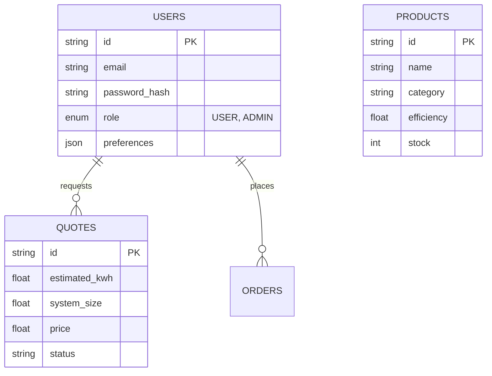
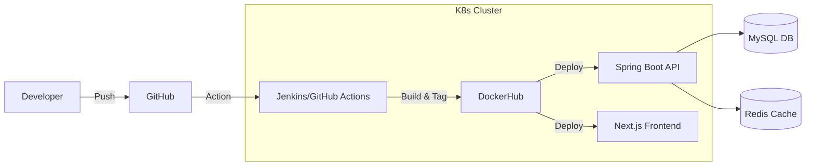

# 🌞 ARS NEXUS 2025: Solar Energy Platform Architecture
*Vision 2.0 for ARS ENGINEERS*

## 1. Concept & Description
**Name:** ARS NEXUS
**Core Philosophy:** "Energy at the Speed of Light."
A futuristic, AI-driven solar energy platform that transcends traditional brochure websites. It serves as a dynamic hub for homeowners and businesses to simulate, purchase, and manage solar solutions.

**Visual Identity:** "Eco-Futurism"
- **Glassmorphism:** Frosted glass panels for cards and dashboards, floating over deep, rich solar-green/black gradients.
- **Neumorphism:** Soft, extruded interactive elements (toggles, sliders) for tactile feel.
- **Motion:** Parallax scrolling where solar panels rotate with scroll depth; beam of light effects on hover.
- **Color Palette:**
  - *Primary:* `Neon Emerald` (#00FF9D) - High energy, active elements.
  - *Secondary:* `Deep Space Green` (#022C22) - Backgrounds.
  - *Accent:* `Solar Gold` (#FFD700) - Analytics/Sun data.
  - *Text:* `Holographic White` (#F0FDF4) - With subtle glow capabilities.

---

## 2. Sitemap Strategy

### Public Zone
1.  **Home (The Solarverse)** - 3D Hero, AI Quick-Quote, Impact counter.
2.  **Smart Solutions** - Residential, Commercial, Hybrid - with interactive 3D models.
3.  **Solar Journey** - Interactive timeline of installation.
4.  **The Lab (Blog)** - AI-curated news, tech deep dives.
5.  **About Nexus** - Mission, Team, Carbon offset tracker.
6.  **Contact & Support** - Voice-enabled search, AI Chatbot.

### User Zone (Secured)
1.  **Dashboard** - Real-time energy stats (mockup or API connected).
2.  **My Projects** - Installation status tracker.
3.  **Documents** - Contracts, Warranties.
4.  **Profile** - Settings, Dark/Light preference.

### Admin Zone
1.  **Command Center** - Global analytics, Heatmaps.
2.  **CRM** - Lead management from AI Chatbot.
3.  **CMS** - Blog/Products management.
4.  **System Health** - API latency, Error logs.

---

## 3. UI/UX Wireframe Concepts

### Hero Section (Home)
- **Background:** WebGL Canvas showing a rotating 3D Earth with lighting up cities (Solar adoption).
- **Foreground:** Glass card "Calculate Your Solar Potential".
- **Interaction:** Voice Search microphone icon pulsing softly.

### Product Page
- **Layout:** Bento-grid style specifications.
- **Media:** 360-degree view of inverters/panels.
- **Action:** Sticky bottom bar "Add to Setup" on mobile.

### Dashboard
- **Charts:** Recharts/D3.js animated line graphs with glowing strokes.
- **Cards:** Glassmorphic tiles with noise texture opacity.

---

## 4. Component Breakdown (Atomic Design)
- **Atoms:** Neon Buttons, Glow Text, Glass Icons, Neumorphic Toggles.
- **Molecules:** Search Bar with Voice Input, Stat Card (Icon + Value + Sparkline).
- **Organisms:** Navbar (Sticky, blurry), Hero Unit, Product Carousel, Testimonial Slider.
- **Templates:** Landing Page, Auth Layout, Dashboard Grid.

---

## 5. Technology Stack Implementation

### Frontend: **Vanilla HTML5 + CSS3 + JavaScript (ES6+)**
*Why?* Maximum control, lightweight, no build steps required for user changes.
- **Styling:** Custom CSS Variables (Glassmorphism/Neumorphism system).
- **Interactivity:** Vanilla JS (AJAX for API calls).
- **Animations:** CSS Keyframes + Intersection Observer API.
- **Icons:** FontAwesome / SVG.

### Backend: **Java Spring Boot 3.2**
*Why?* Robust, scalable, type-safe, and we already migrated to it.
- **Build:** Maven.
- **Security:** CSRF protection, Input validation.
- **API:** REST Controllers serving JSON.
- **Hosting:** Embedded Tomcat (Port 8080).

### Database
- **Primary (Relational):** MySQL 8.0 (Users, Orders, Projects).
- **Cache:** Redis (Session, AI responses, Frequent queries).
- **Search:** Elasticsearch (for Blog/Products voice search).

---

## 6. Database Design (Enhanced Schema)

---

## 7. API Endpoints Structure (RESTful)

### Auth
- `POST /api/v1/auth/signup`
- `POST /api/v1/auth/login` (Returns JWT)
- `POST /api/v1/auth/refresh`

### AI Features
- `POST /api/v1/ai/solar-calculator` (Input: Roof size -> Output: Savings)
- `POST /api/v1/ai/chat` (Contextual RAG chatbot)

### Core
- `GET /api/v1/products?category=inverter&sort=efficiency`
- `GET /api/v1/dashboard/stats` (Secured)

---

## 8. Admin Dashboard Features
- **Live User Map:** Real-time view of active users on the site.
- **AI Insights:** "Predicted detailed revenue for Q3 based on current leads."
- **Content Studio:** Rich Text Editor for blog posts.
- **Role Management:** Grant granular permissions.

---

## 9. AI Features & Integrations
1.  **Solar Bot 9000:**
    - Uses RAG (Retrieval-Augmented Generation) to answer "What is the warranty on X panel?" by reading uploaded PDF docs.
2.  **Voice Search:**
    - "Show me solar panels under $500." -> Transcribes audio -> Queries DB filters.
3.  **Smart Recommendations:**
    - "Based on your location (Indore), we recommend Monocrystalline panels."

---

## 10. Deployment Architecture (DevOps)

- **Containerization:** Docker for all services.
- **Orchestration:** Kubernetes (K8s) for scaling.
- **CDN:** Cloudflare for static assets and edge security.

---

## 11. Scalability & Security
- **Security:**
  - **Rate Limiting:** Bucket4j on API Gateway.
  - **OAuth2:** Login with Google/Apple.
  - **Sanitization:** XSS protection, SQL Injection safe (JPA).
- **Scalability:**
  - **Horizontal:** Autoscaling K8s pods based on CPU/RAM.
  - **Database:** Read Replicas (Master-Slave) for high traffic.
